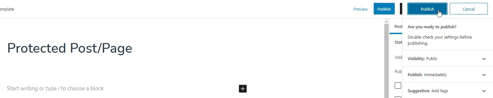
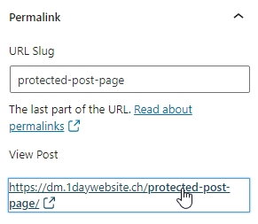
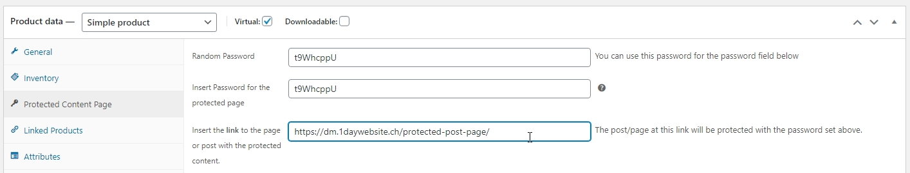
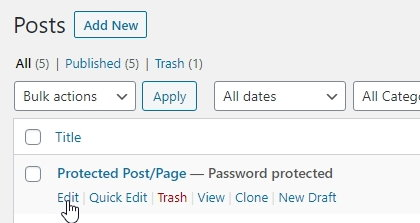
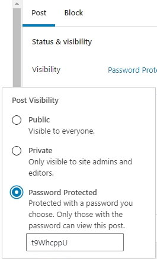
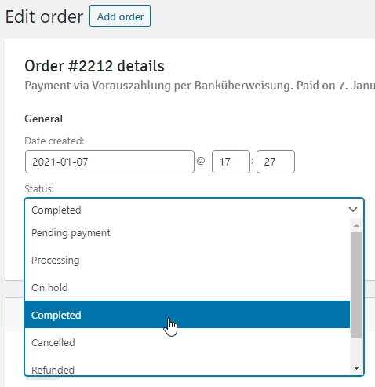

# Woocommerce Buy Protected Page

## Description ##

### Sell protected content (post/page) with a WooCommerce product. Includes automatic content password protection. After a purchase link and password will be sent to the buyer in the order confirmation email (only if order completed) and will be listed in the customer account (if created). ###

## How to use this plugin ##

Create the post (or page) with the content you want to sell. Publish it.

Copy the URL of this post (into the clipboard for the moment).

Create a WooCommerce product (simple product will do) and set it to "Virtual". A new tab named "Protected Content Page" will open up.

Next, paste the URL of the post with the content you want to sell and protect into the link field highlighted below.

At the top you find a password generator (Random Password). You can copy that password and insert into the password field (Field Name: "Insert Password for the protected page")

When you're done, hit publish.

If you return to the list of posts, you will see that the post is now protected.

If you check, you can see it's the password that you've inserted into your WooCommerce product. As an admin or editor you can now edit the post and add your unique content that later a buyer with the password can access.

The email with the link to the protected page and the password for access will only be sent, once the order is complete. If you use PayPal or some other payment processor this should happen automatically. If you use manual payment methods (like payment in advance, payment on pickup etc.), you have to complete the order, as shown below:

## Installation ##
In the upper right corner download the plugin as a ZIP file and unpack the folder within.

There are two ways of installation:

1. If you use FTP (or some other form), upload the folder to `/wp-content/plugins/` and activate the plugin within the WordPress dashboard.
2. Install the plugin via "Plugins - Install - Upload Plugin" in the WordPress dashboard, then activate it.

## Changelog ##

### 1.0.0 ###
Erste Version: Tested with Woocommerce 4.8 und WordPress 5.6
